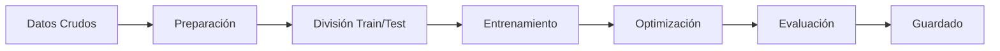
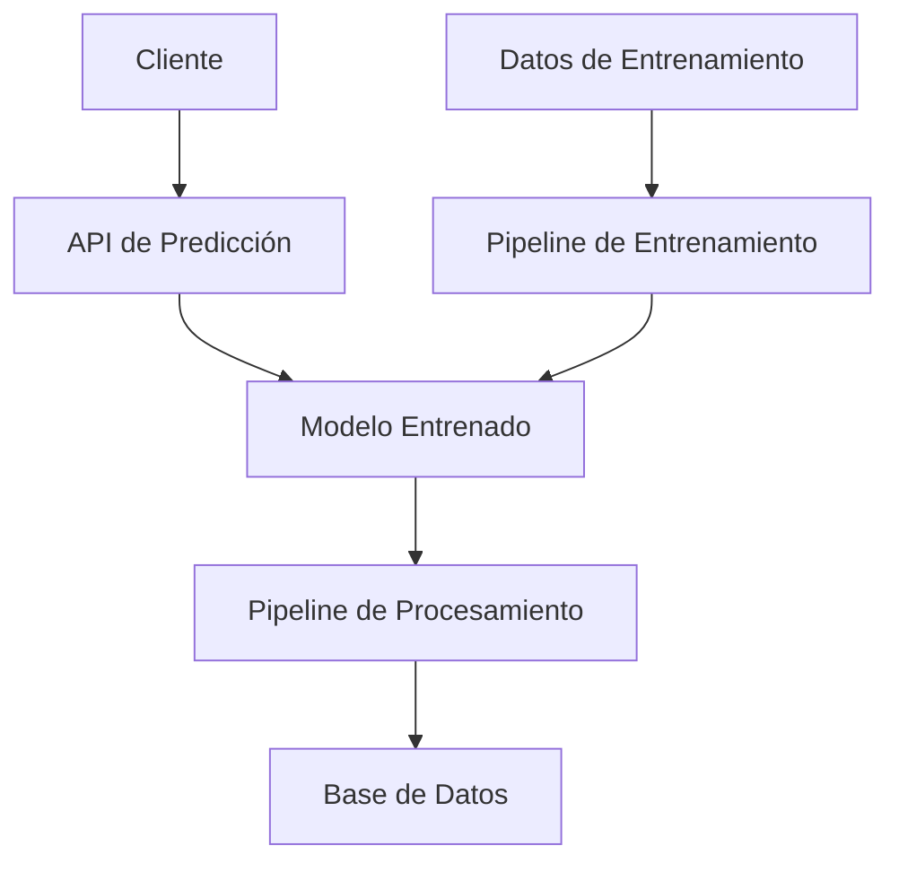
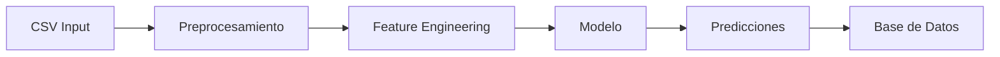
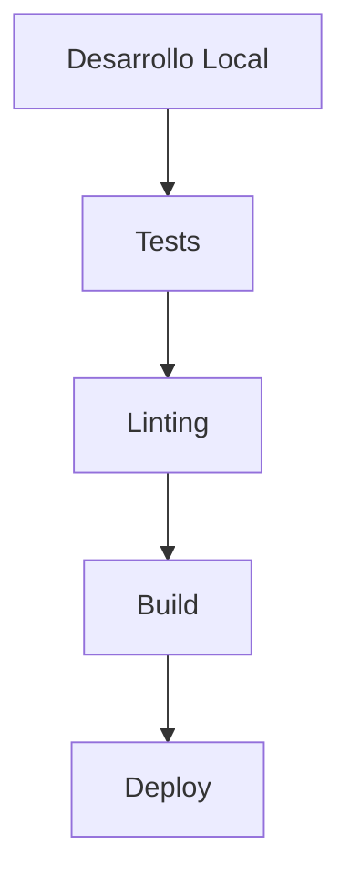

# Sistema MLOps para Predicción de Precios de Alquiler 🏠

## Descripción General
Este proyecto implementa un sistema MLOps completo para predecir precios de alquiler de apartamentos. Utiliza técnicas de machine learning con Random Forest y sigue las mejores prácticas de MLOps para el desarrollo, entrenamiento y despliegue de modelos.

## Características Principales
- 🤖 Modelo de Random Forest para predicción de precios
- 🔄 Pipeline automatizado de preprocesamiento de datos
- 📊 Optimización de hiperparámetros mediante GridSearchCV
- 📝 Logging detallado de todas las operaciones
- 🔒 Validación y tipado fuerte con Pydantic
- 🗃️ Integración con SQLite para almacenamiento de datos

## Stack Tecnológico
- **Python 3.11+**
- **Bibliotecas principales:**
  - pandas (2.2.3): Procesamiento de datos
  - scikit-learn (1.5.2): Algoritmos de ML
  - SQLAlchemy (2.0.36): ORM para base de datos
  - Pydantic (2.9.2): Validación de datos
  - Loguru (0.7.2): Sistema de logging
- **Herramientas de desarrollo:**
  - Poetry: Gestión de dependencias
  - Flake8: Linting de código
  - Jupyter: Notebooks para experimentación

## Estructura del Proyecto
```
.
├── src/
│   ├── config/           # Configuraciones del proyecto
│   ├── data/            # Datos de entrada
│   ├── databases/       # Módulos de base de datos
│   ├── logs/           # Archivos de log
│   ├── model/          # Lógica del modelo
│   │   ├── pipeline/   # Pipeline de procesamiento
│   │   └── models/     # Modelos entrenados
│   └── notebooks/      # Jupyter notebooks
├── Makefile            # Comandos de automatización
├── pyproject.toml      # Configuración de Poetry
└── README.md          # Documentación
```

## Diagramas de Flujo

### Pipeline de Machine Learning


### Arquitectura del Sistema


### Flujo de Datos


## Instalación

1. Clonar el repositorio:
```bash
git clone <repositorio>
cd mlops-rent-prediction
```

2. Instalar dependencias con Poetry:
```bash
poetry install
```

## Configuración
1. Configurar variables de entorno en `src/config/.env`
2. Ajustar parámetros del modelo en `src/config/model_settings.py`
3. Definir características en `src/config/features.yaml`

## Uso

### Entrenamiento del Modelo
```bash
make builder
```

### Inferencia
```bash
make inference
```

### Verificación de Código
```bash
make check
```

## API de Predicción

El modelo expone las siguientes características para predicción:
- area
- constraction_year
- rooms
- bedrooms
- bathrooms
- balcony
- storage
- parking
- furnished
- garage
- garden

### Ejemplo de Uso
```python
from src.model.model_inference import predict_rent

features = {
    "area": 100,
    "constraction_year": 2010,
    "rooms": 4,
    # ... otras características
}

prediction = predict_rent(features)
```

## Desarrollo

### Guías de Desarrollo
1. Usar Poetry para gestión de dependencias
2. Seguir PEP 8 para estilo de código
3. Documentar funciones y clases
4. Mantener los tests actualizados

### Procedimientos de Testing
1. Ejecutar tests unitarios:
```bash
poetry run pytest
```

2. Verificar calidad del código:
```bash
make check
```

## Flujo de Deployment


## Consideraciones de Seguridad
- Validación de entradas con Pydantic
- Configuraciones sensibles en variables de entorno
- Logging de acciones críticas
- Control de acceso a la base de datos

## Guía de Contribución
1. Fork del repositorio
2. Crear rama feature: `git checkout -b feature/nueva-funcionalidad`
3. Commit cambios: `git commit -am 'Añadir nueva funcionalidad'`
4. Push a la rama: `git push origin feature/nueva-funcionalidad`
5. Crear Pull Request
